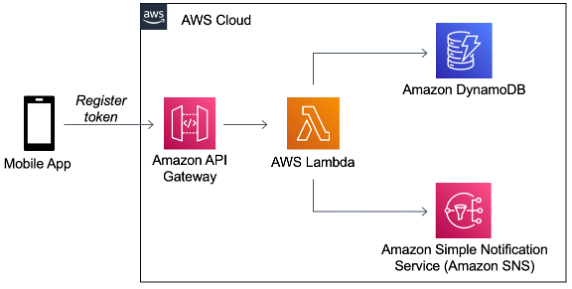

# Sending mobile push notifications and managing device tokens with a serverless application
This repository contains an AWS Serverless Application Model (SAM) template and other required resources to deploy a serverless solution solving common challenges encountered when sending Simple Notification Service (SNS) push notifications. The common challenges include managing mobile application tokens, making sure they are up to date and keeping track of mappings between end users, SNS endpoints and mobile application tokens.

## Solution Overview
The solution uses the following AWS services:
- Amazon API Gateway: Provides a token registration endpoint URL used by the mobile application. Once called, it invokes an AWS Lambda function via the Lambda integration.
- Amazon SNS: Generates and maintains the target endpoint and manages platform application objects.
- Amazon DynamoDB: Serverless database for storing endpoints that also maintains a mapping between the user, endpoint, and mobile operating system.
- AWS Lambda: Retrieves endpoints from DynamoDB, validates and generates endpoints, and publishes notifications by making requests to SNS.

The following diagram represents a simplified interaction flow between the AWS services:



## Build

To build and deploy the application for the first time, run the following in your shell:

```bash
sam build 
sam deploy --guided
```
## Cleanup

To delete the application, use the AWS CLI replacing &lt;stack-name&gt; with the stack name you configured during deployment, and run the following:

```bash
aws cloudformation delete-stack --stack-name <stack-name>
```
